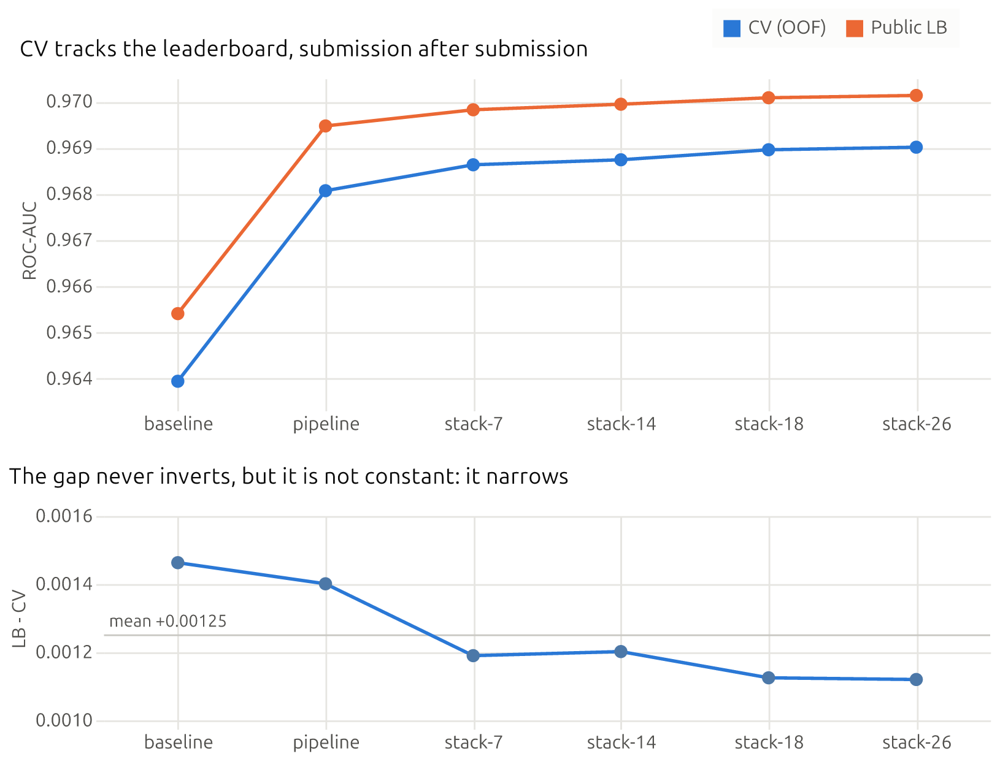
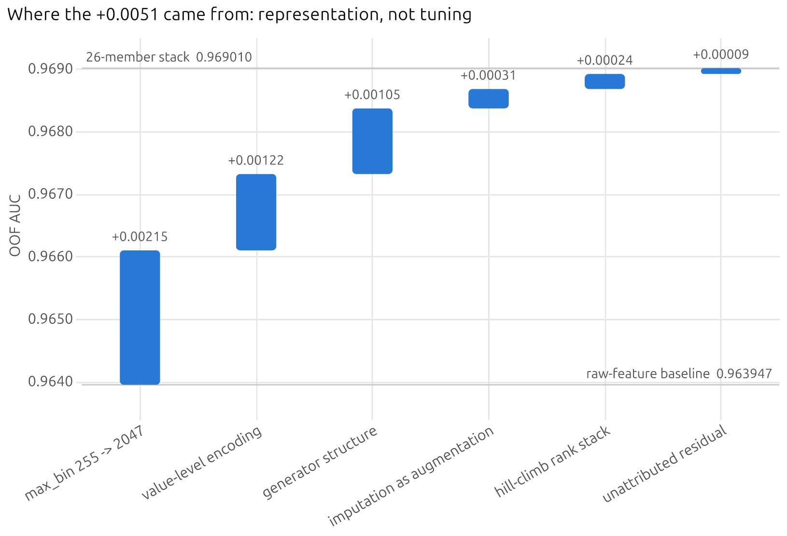
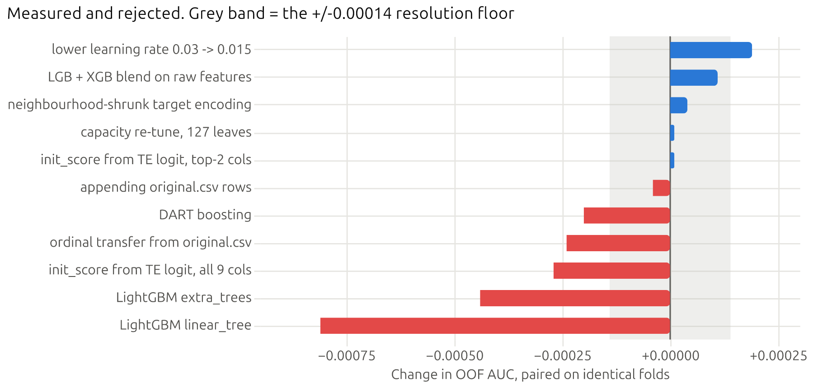
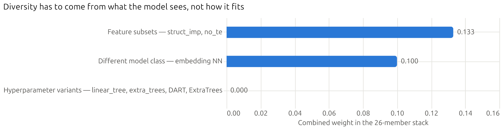

# Predicting Smartphone Addiction

Machine learning entry for the Kaggle [Playground Series — Season 6, Episode 8](https://www.kaggle.com/competitions/playground-series-s6e8)
competition: predicting the likelihood of smartphone addiction from behavioural and usage data.

**Public LB 0.97013 — rank 728 / 3353, top 21.7%.**

> **The finding this project is actually about:** standalone strength does not predict
> incremental value. A feature that improved its own univariate AUC by +0.0025 delivered
> +0.00004 in the model. A transfer model that recovers the label at 0.9893 AUC *hurt*
> when its output was added. The most decorrelated ensemble member of all earned exactly
> zero weight. The useful question is never "does this carry signal" but **"does this let
> the model ask something it currently cannot"** — and answering it requires a ledger of
> paired measurements, which is most of what is in this repository.

## The problem

| | |
|---|---|
| **Task** | Binary classification — predict `addicted_label` |
| **Metric** | **ROC-AUC** |
| **Training data** | 691,369 rows × 12 features (9 numeric, 3 categorical) |
| **Class balance** | 70.9% positive |
| **Missingness** | Every feature 4–20% null; 61.1% of rows have at least one null |

Because the metric is AUC, only the *ranking* of predictions matters: probability calibration
and decision-threshold tuning are irrelevant to the score, and rank-based ensembling is well
motivated.

## Results

| Submission | CV (OOF AUC) | Public LB | Rank |
|---|---|---|---|
| [`baseline.py`](src/smartphone_addiction/baseline.py) — raw features, no imputation | 0.963947 | 0.96541 | 1761 / 3353 |
| [`pipeline.py`](src/smartphone_addiction/pipeline.py) — representation pipeline | 0.968069 | 0.96947 | 904 |
| 7-member stack | 0.968630 | 0.96982 | 821 |
| 14-member stack (+ XGBoost) | 0.968738 | 0.96994 | 777 |
| 18-member stack (+ ES-reclaim, NN) | 0.968955 | 0.97008 | 740 |
| **26-member stack (+ feature subsets)** | **0.969010** | **0.97013** | **728 (top 21.7%)** |



CV never disagreed with the leaderboard about the *direction* of a change, so CV was a
trustworthy selection instrument and leaderboard probing was never needed. The offset is
**+0.00125 mean, sd 0.00015, range +0.00112 … +0.00146**, and it is not a constant: it
falls monotonically as the stack grows, which is what you would expect from an ensemble
whose extra members buy less on the public split than they do in-fold. The check that
matters is that structural changes moved both together — **CV +0.00412 produced
LB +0.00406**. A leaking encoder would have moved CV without moving the leaderboard.

### What produced the gain: representation, not tuning



Each measured as a paired arm on identical folds.

| Mechanism | Gain | Why it works |
|---|---|---|
| `max_bin` 255 → 2047 | +0.00215 | Six of nine numeric columns have more distinct values than LightGBM's default 255 bins (`weekend_screen_time` 1460, `daily_screen_time_hours` 1398). The label rule has hard steps at exact 2-decimal values; at 255 bins the bucket straddling `daily = 8.00` holds ~2,300 rows the model cannot separate. |
| Value-level encoding | +0.00122 | `notifications_per_day` has raw univariate AUC 0.5079 but **0.7486** target-encoded. Adjacent integer values differ in target rate by 0.22 against a sampling sd of 0.008 — these columns are lookup keys, not quantities, and a tree needs two splits per value to express that. |
| Generator structure | +0.00105 | `daily ≥ social + gaming + work` holds for **100.000%** of complete rows, so the residual is a real hidden quantity and, where a term is missing, the constraint *bounds* it. A four-term linear combination is the one thing axis-aligned trees provably cannot construct. |
| Imputation as augmentation | +0.00031 | Imputed columns **alongside** the NaN-bearing originals. Replacing them instead is measured *negative* elsewhere: a learned per-split default direction beats a point estimate. |
| Hill-climb rank stack | +0.00024 | Greedy selection with replacement, weights fitted on 4 folds and scored on the 5th. |

### Measured and rejected



Every row is a paired same-fold comparison. The list is the point: in a saturated model,
most plausible ideas are worth nothing, and knowing which is what the ledger buys.

| Idea | Effect |
|---|---|
| Hyperparameter search (`num_leaves` 31/63/255) | span 0.00046 — under one fold sd |
| Capacity re-tune on the wide matrix (127 leaves) | +0.00001 |
| Lower learning rate (0.03 → 0.015) | +0.00019 |
| Neighbourhood-shrunk target encoding (3 arms) | +0.00004 |
| `init_score` from additive TE logit — top-2 cols / all 9 | +0.00001 / **−0.00027** |
| ExtraTrees as a stack member | lowest correlation (0.978), **weight 0** |
| LightGBM `linear_tree` (piecewise-linear leaves) | −0.00081, weight 0 |
| LightGBM `extra_trees` (random thresholds) | −0.00044, weight 0 |
| DART boosting | −0.00020, weight 0 |
| Appending `original.csv` rows to training | −0.00004 (4/5 folds worse) |
| Ordinal transfer feature from `original.csv` | −0.00024 (5/5 folds worse) |
| LightGBM + XGBoost blend on raw features | +0.00011 (rank correlation 0.99542) |
| Missingness indicators / null counts | univariate AUC 0.5017 — MCAR, inert |

Neighbourhood TE improved its own feature by +0.0025 measured standalone and delivered
+0.00004 in the model. A multiclass model on `original.csv` recovers the label at 0.9893
AUC and *hurts* when transferred. ExtraTrees was the most decorrelated member and earned
zero weight.

### Stacking: what actually decorrelates



[`stack.py`](src/smartphone_addiction/stack.py) runs greedy hill-climbing with replacement
over 29 candidate members, with weights fitted on 4 folds and scored on the held-out 5th —
fitting weights on the OOF you then report is the ensembling trap, and it inflates by more
than the entire gain being measured.

Diversity has to come from *what the model sees*, not *how it fits*. `linear_tree` was only
−0.0008 behind with the second-lowest correlation of any tree and still earned nothing,
while `struct_imp` — denied our single largest feature win — took the fifth-largest weight.

Two further measured results on ensembling. Seed-averaging the NN raised its solo AUC by
+0.0044 but raised its correlation from 0.96 to 0.978, so the stack gained only +0.000019:
averaging removed exactly the idiosyncratic variance that made it useful. And entering the
three seeds as *separate* members instead earned zero, because their average was already in
the pool and strictly dominates them.

### Leakage discipline

Target encoding is the one component touching the label, and it is nested twice: an outer
fold's validation rows are encoded only from that fold's training rows, and those training
rows are encoded through an inner 5-fold so no row contributes to its own encoding. Early
stopping runs on a per-fold inner slice, never on the rows being scored. Stack weights are
fitted on 4 folds and scored on the 5th, because fitting weights on the OOF you then report
is the classic ensembling trap.

Two checks hold that claim up. Empirically, **CV +0.00412 produced LB +0.00406** — a
leaking encoder moves CV without moving the leaderboard. And
[`tests/test_members.py`](tests/test_members.py) runs the whole target-encoding path under a
**shuffled label**, where it must score chance; an encoder that lets a row see its own label
cannot pass that test.

**Imputation strategy: none by default.** LightGBM's learned per-split default direction for
NaN is strictly more expressive than a point estimate. Missingness is handled by giving NaN
its own encoding level, computing the budget residual under both NaN conventions, and
deriving hard bounds from the generator constraint where the algebra pins a missing value
down. Imputed columns are added only as extra features, never as replacements.

## Setup

```bash
# Install pixi if needed: https://pixi.sh
pixi install
```

## Data

Competition data is not committed to the repo (per Kaggle rules). To download it you need a Kaggle API token:

1. Go to [kaggle.com/settings](https://www.kaggle.com/settings) → **API** → **Create New Token**
2. Place the downloaded `kaggle.json` in `~/.kaggle/` (Windows: `C:\Users\<you>\.kaggle\`)
3. Accept the competition rules on the [competition page](https://www.kaggle.com/competitions/playground-series-s6e8)

Then:

```bash
pixi run data
```

This downloads and extracts `train.csv`, `test.csv`, and `sample_submission.csv` into `data/raw/`.

## Project Structure

| Path | Purpose |
|---|---|
| `data/raw/` | Original competition data (gitignored, rebuild with `pixi run data`) |
| `data/processed/` | Cleaned and transformed outputs, including `members/` |
| `notebooks/` | Exploratory analysis (marimo apps) |
| `src/smartphone_addiction/` | Reusable Python package (features, models, submission helpers) |
| `submissions/` | Generated submission files (gitignored) |
| `tests/` | Unit tests, including the leakage battery |
| `docs/figures/` | Exported figures referenced above, plus their Vega-Lite specs |

## Development

```bash
pixi run check       # lint + typecheck + test
pixi run format      # auto-format with ruff
pixi run lint        # check style with ruff
pixi run typecheck   # check types with ty
pixi run test        # run pytest
pixi run figures     # redraw docs/figures from the ledger (needs no data)
```

Notebooks are [marimo](https://marimo.io) apps — plain `.py` files that diff cleanly. Open one with:

```bash
pixi run marimo edit notebooks/<name>.py
```

## Reproducing the results

```bash
pixi run python -m smartphone_addiction.baseline   # raw-feature baseline -> submissions/lgbm_baseline.csv
pixi run python -m smartphone_addiction.pipeline   # full pipeline        -> submissions/lgbm_pipeline.csv
pixi run members                                   # every stack member   -> data/processed/members/
pixi run python -m smartphone_addiction.stack --submit   # hill-climb stack -> submissions/lgbm_stack.csv
```

All of these are deterministic at seed 42 and write out-of-fold predictions to
`data/processed/`, so any later comparison can be run as a paired same-fold test.
`pixi run members` is the expensive step — six arms × 5 folds on 691,369 rows.

### What reproduces, and what does not

**The 0.97013 leaderboard score does not reproduce from this repository, and it is worth
being exact about why.** That submission was a 26-member stack drawn from 29 candidate arms
assembled over the competition. The ledger above names the arms that mattered, but the full
set of recipes was never committed, and one weight-earning member was an embedding neural
network whose framework is not a dependency of this project. Those arms are gone.

What [`members.py`](src/smartphone_addiction/members.py) rebuilds instead is a **documented,
reduced member set** — four feature subsets plus XGBoost and CatBoost for model-class
diversity — chosen to reproduce the *finding* rather than the score. The four zero-weight
hyperparameter variants (`linear_tree`, `extra_trees`, DART, ExtraTrees) are absent because
they were refuted, not because they were overlooked. `stack.py` reports its own honest
held-out number for whatever member set it finds.

Everything else on this page — the baseline, the pipeline, the gain decomposition, and the
leakage tests — reproduces exactly.
